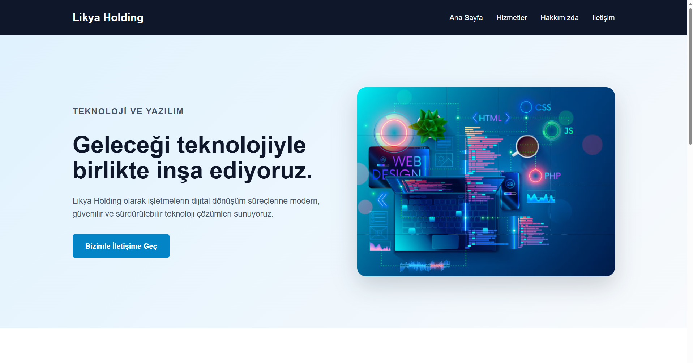
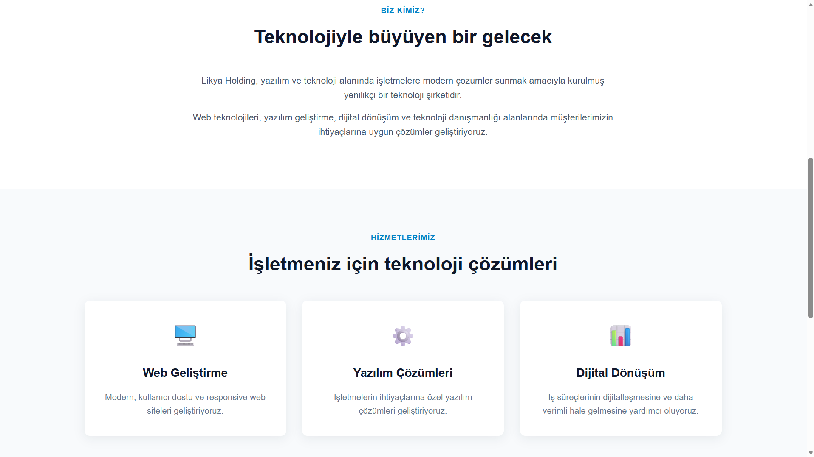
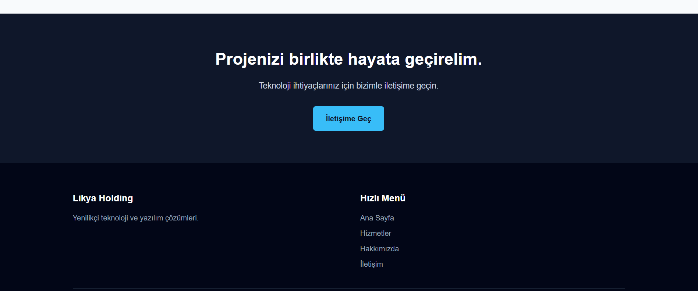
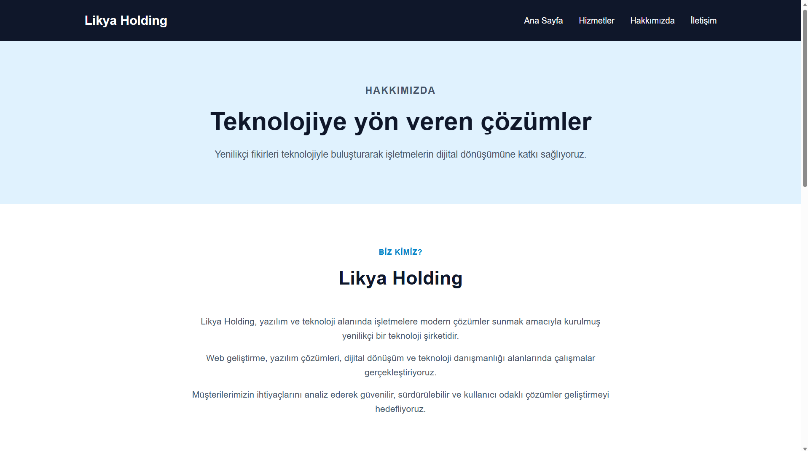
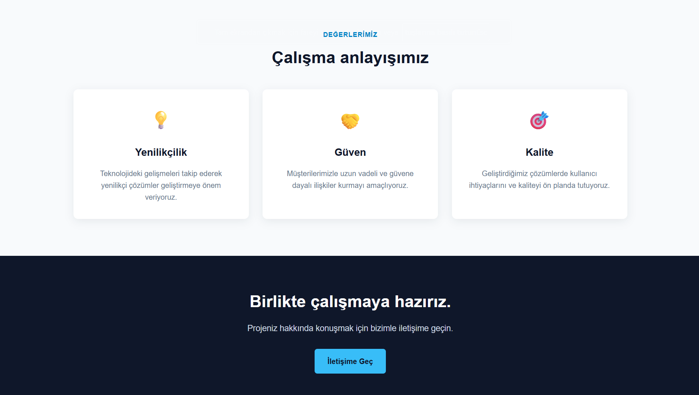
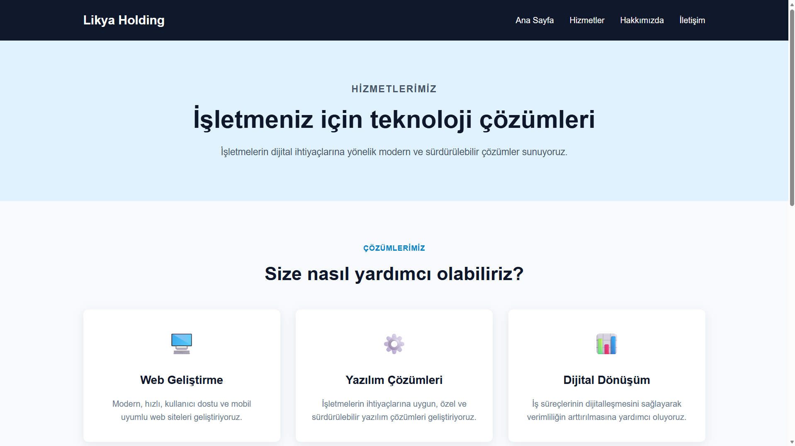
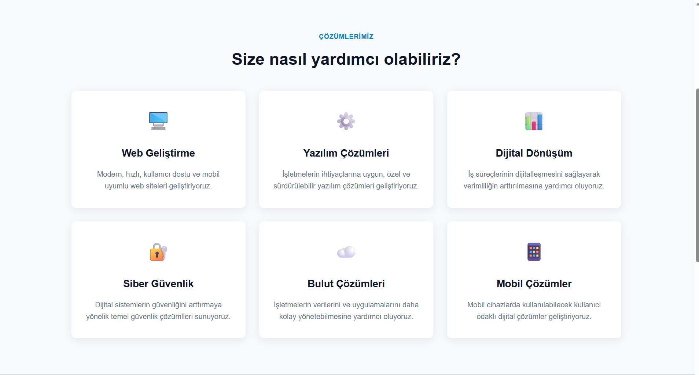
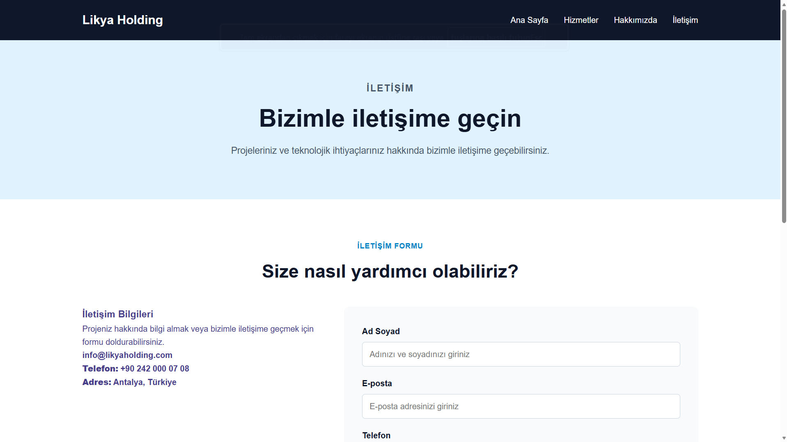
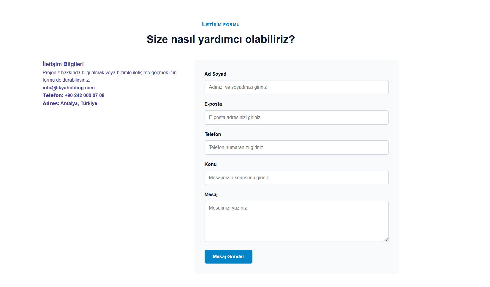

# Kurumsal Web Sitesi

## Proje Hakkında

Bu proje, hayali bir yazılım şirketi için hazırlanmış 4 sayfalık kurumsal bir web sitesi çalışmasıdır.

Proje kapsamında HTML5 ve CSS kullanılarak kullanıcı dostu, responsive ve modern bir web sitesi tasarlanmıştır.

## Kullanılan Teknolojiler

- HTML5
- CSS3
- Flexbox
- CSS Grid
- Responsive Web Design

Projede Bootstrap veya Tailwind gibi hazır CSS frameworkleri kullanılmamıştır.

## Web Sitesi Sayfaları

### Ana Sayfa

Şirketin genel tanıtımının yapıldığı ana sayfadır. Hero alanı, şirket tanıtımı ve hizmet kartları bulunmaktadır.

### Hizmetler

Şirket tarafından sunulan hizmetlerin kart yapısı kullanılarak gösterildiği sayfadır.

### Hakkımızda

Şirketin tanıtıldığı, çalışma prensiplerinin ve şirketin bilgilerinin yer aldığı sayfadır.

### İletişim

Kullanıcıların şirketle iletişime geçebilmesi için iletişim bilgilerinin ve iletişim formunun bulunduğu sayfadır.

## Proje Özellikleri

- 4 farklı HTML sayfası
- Responsive tasarım
- Mobil uyumluluk
- Tablet uyumluluğu
- Masaüstü uyumluluğu
- Header ve navigation
- Hero bölümü
- Hizmet kartları
- Footer
- İletişim formu
- Flexbox kullanımı
- CSS Grid kullanımmı
- Görsellerde alt açıklamaları
- Form alanlarında label kullanımı
- Form alanlarında required kullanımı
- Uygun input type  değerleri
- Harici CSS dosyası
- Inline CSS kullanılmaması
- Bootstrap kullanılmaması
- Tailwind kullanılmaması

## Ekran Görüntüleri

### Ana Sayfa





### Hakkımızda




### Hizmetler




### İletişim




## Proje Yapısı

```text
kurumsal-web-sitesi/
│
├── index.html
├── hizmetler.html
├── hakkimizda.html
├── iletisim.html
│
├── css/
│   └── style.css
│
├── images/
│   ├── ekran-ana-sayfa.png
│   ├── ekran-hizmetler.png
│   ├── ekran-hakkimizda.png
│   └── iletisim.png
│
└── README.md
